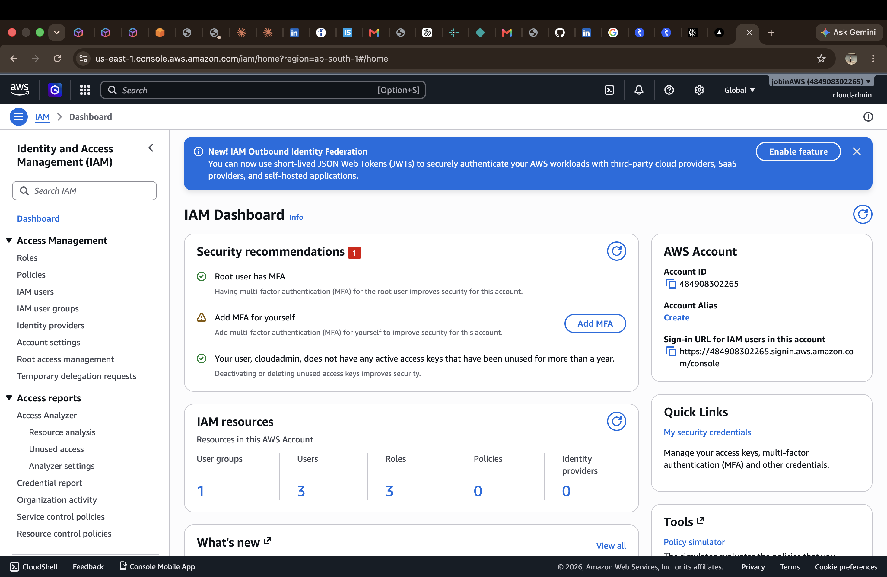
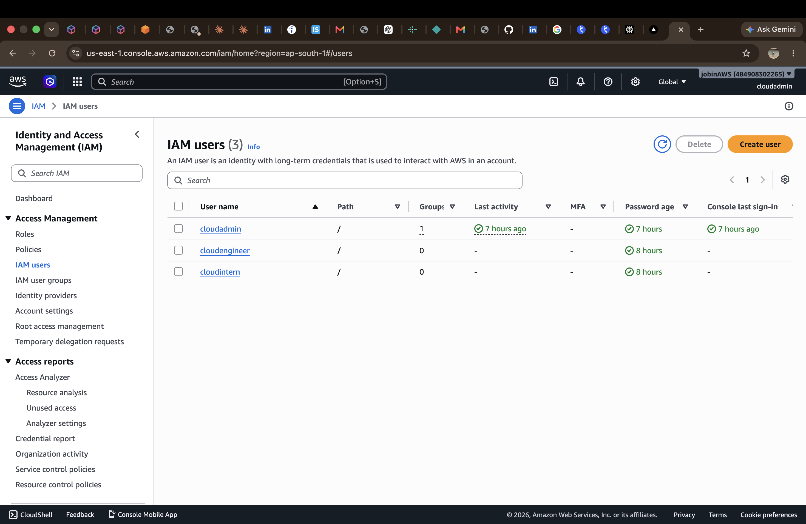
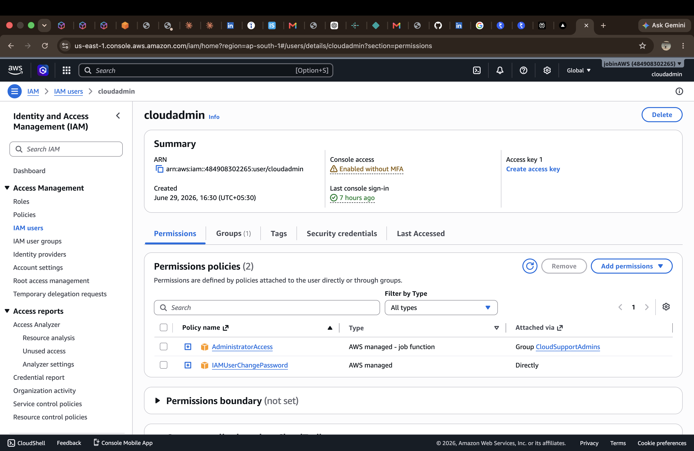
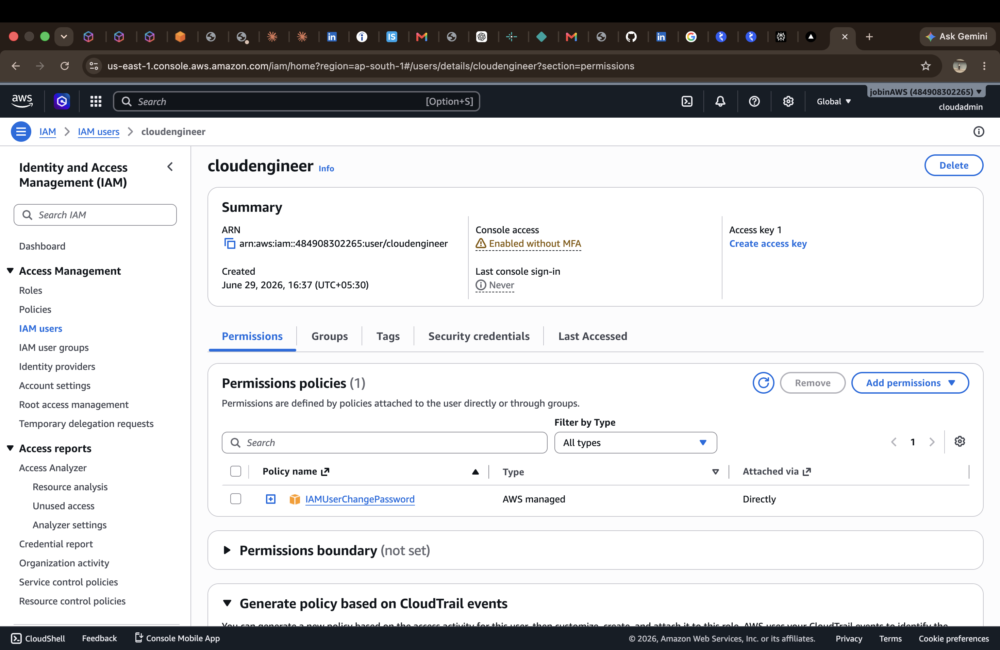
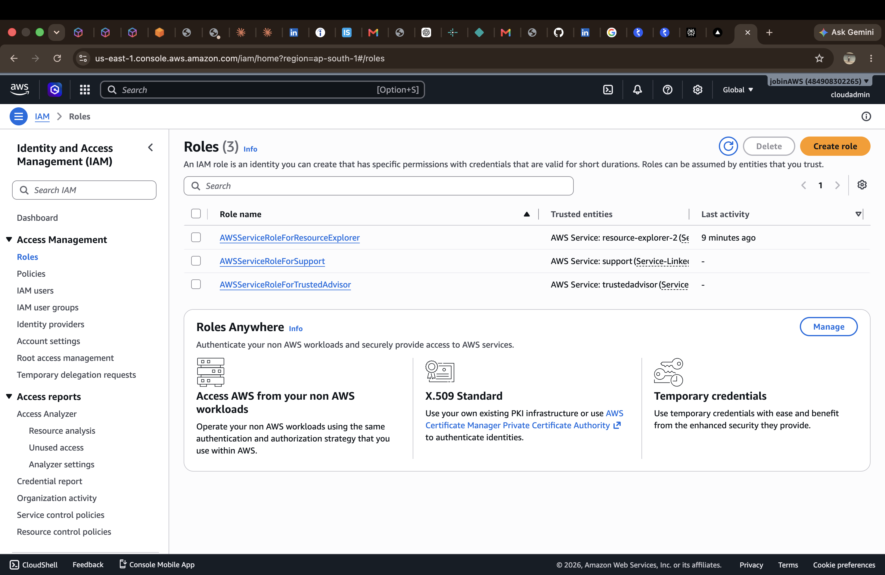
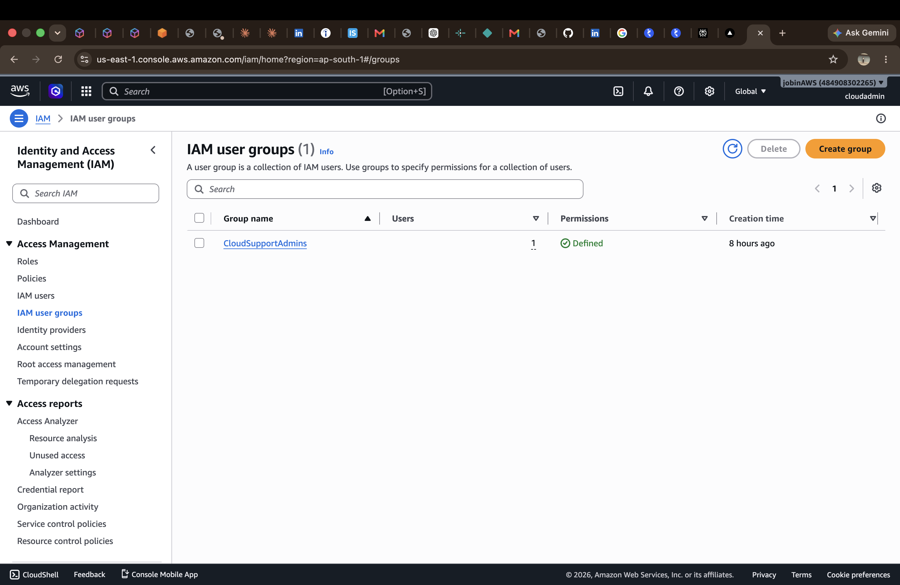
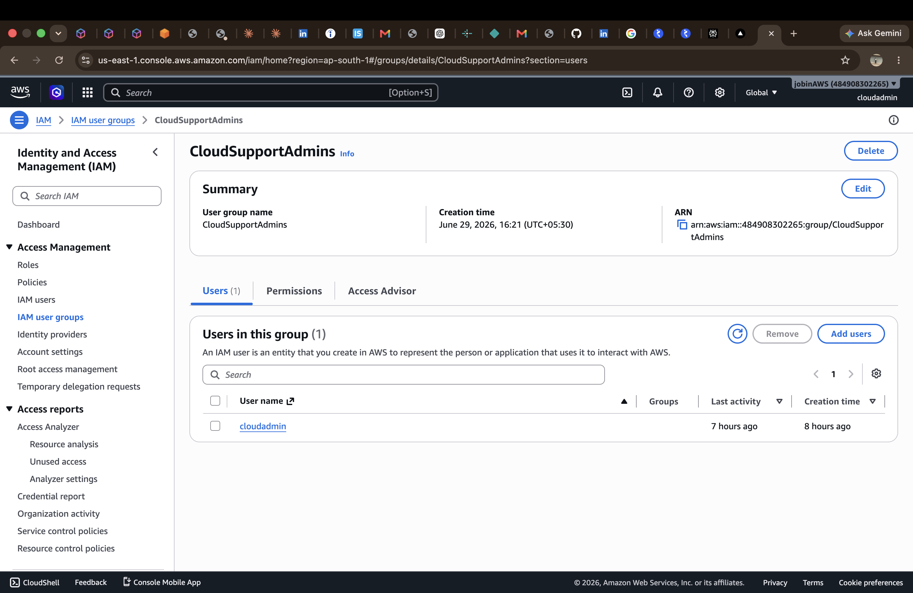
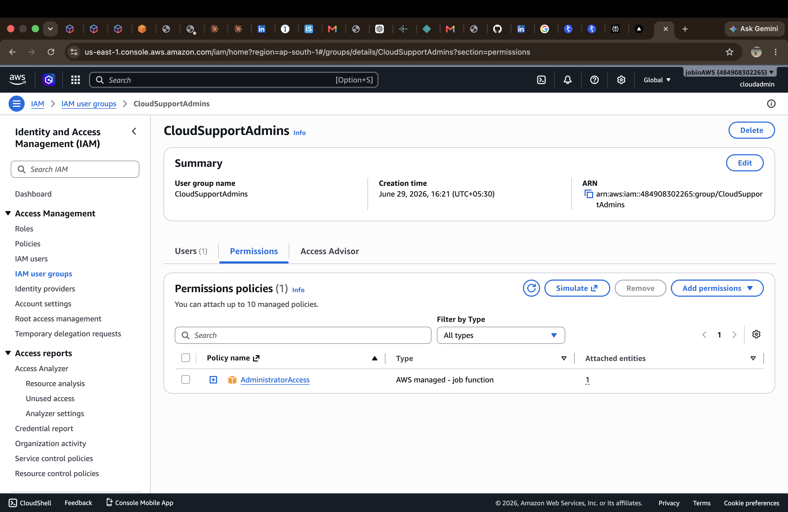
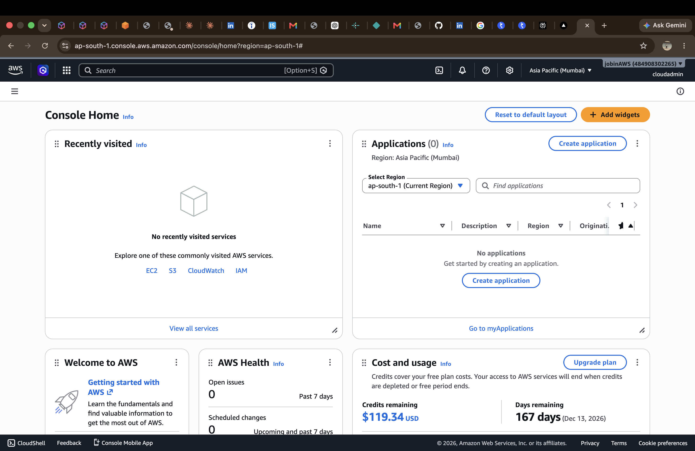

# AWS IAM User & Access Management Lab

## Project Overview
This project demonstrates practical implementation of AWS Identity and Access Management (IAM) by creating users, groups, policies, and managing secure access to AWS resources.

## Objective
- Learn IAM fundamentals
- Create IAM users and groups
- Assign permissions using AWS managed policies
- Apply the Principle of Least Privilege
- Secure AWS account access

## AWS Services Used
- AWS IAM

## Features Implemented
- Created IAM users
- Created IAM user groups
- Attached AWS managed policies
- Added users to groups
- Configured console access
- Reset IAM user passwords
- Verified user permissions
- Tested IAM user login
- Managed user access securely

## Skills Demonstrated
- Identity and Access Management
- User Administration
- Group-based Permission Management
- AWS Security Best Practices
- Least Privilege Access
- AWS Console Administration

## Project Architecture

Root User
↓
IAM Group
↓
IAM Users
↓
AWS Managed Policies
↓
Secure AWS Resource Access

## Learning Outcomes
- Understood IAM authentication
- Learned permission management
- Managed users and groups
- Implemented secure AWS access
- Practiced real-world IAM administration

## Repository Structure

```
README.md
screenshots/
```

## Screenshots

### IAM Dashboard


### IAM Users


### CloudAdmin Permissions


### CloudEngineer User Details


### IAM Roles


### IAM User Groups


### Group Users


### Group Permissions


### AWS Console Home (IAM Login)


## Author

**Jobin George**
Cloud Support Engineer Aspirant
